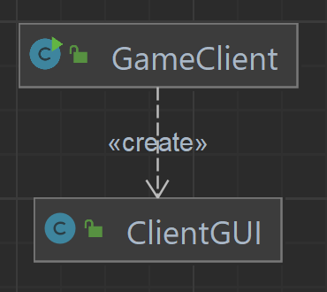
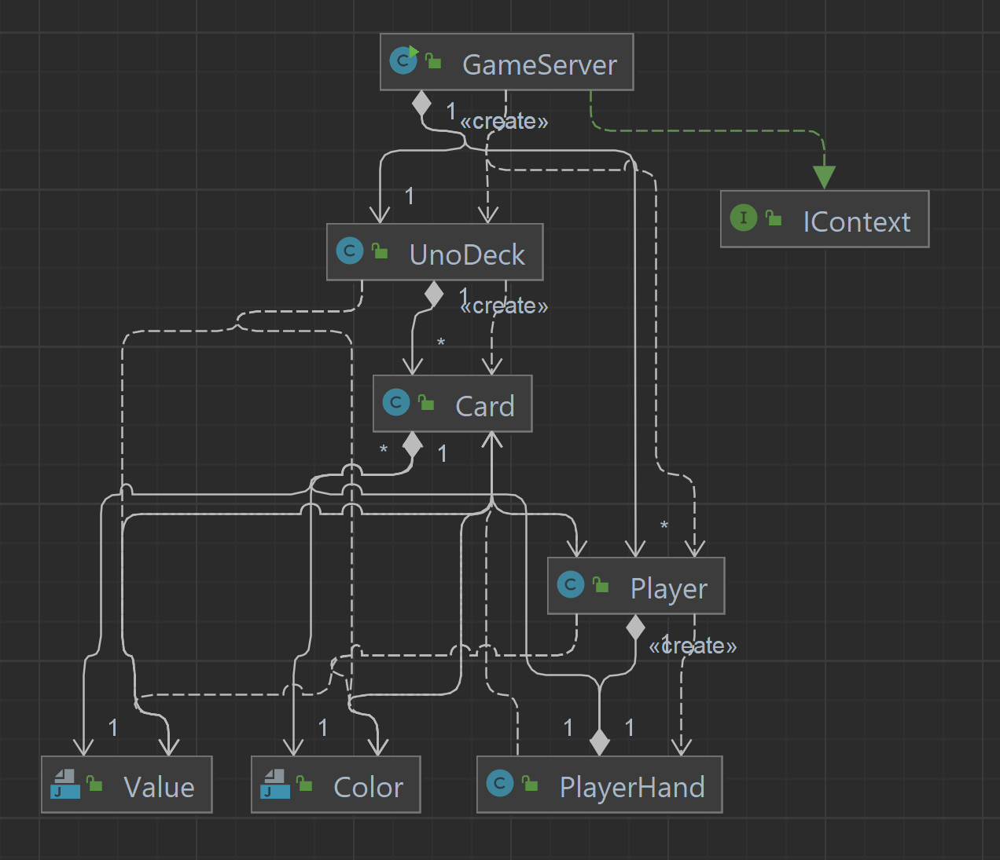

# UNO

## Contexte
Ce projet est réalisé par Corentin Goetghebeur et Chris Arridi dans le cadre du cours de Conception Logicielle de
l'ENSTA Bretagne.

Ce projet a été réalisé entre le 14/02/2022 et le 18/03/2022. Le développement du projet n'étant pas terminé à la date
limite de rendu de ce projet, il ne sera pas achevé.

## Objectif
L'objectif de ce projet est la création d'un jeu de UNO jouable en multijoueur en réseau local par TCP.

## Accès au projet:
Le code source du projet est disponible sur GitHub : https://github.com/CorentinGoet/UNO. 

La documentation JavaDoc est disponible à l'adresse: https://corentingoet.github.io/UNO.

## Utilisation
Pour utiliser le logiciel, lancer le fichier UNO.
Pour lancer le serveur, cliquer sur le bouton `start` puis choisir le nombre de joueurs et appuyer sur ok.
Pour lancer le client, cliquer sur le bouton `join` pour rejoindre le server.

## Patrons de conceptions et principes SOLID
Ce projet met en place les patrons de conceptions Observer/Observable, State, Composant/Composite et le pattern Serveur 
Concurrent créé dans les TP de conception logicielle.

Les diagrammes UML sont disponibles dans le dossier readme_docs.
### Pattern Sujet / Observateur
Dans le projet, le pattern Sujet/Observateur est utilisé pour la connection entre les interfaces graphiques du serveur
et du client à leurs classes de logique respectives:
- GameServer (Sujet) et ServerGUI (Observateur)
- GameClient (Sujet) et ClientGUI (Observateur)

Le pattern est implémenté en utilisant `PropertyChangeSupport` et `PropertyChangeListener`.

### Pattern State
Le pattern State est utilisé dans notre projet pour le fonctionnement de la classe du serveur du jeu `GameServer` et de
la classe du client du jeu `GameClient`. Les différents états pour les états sont détaillés dans les énumérations 
`ClientState` et `ServerState`. 

### Pattern Composant / Composite
Le jeu comporte une hiérarchie de classes diverses: Le jeu (`GameServer`et `GameClient`) contient des joueurs (`Player`)
et une pioche (`UnoDeck`), la pioche contient des cartes (`Card`) et le joueur possède lui même une main (`PlayerHand`) 
qui contient des cartes. Les cartes possèdent une couleur (`Color`) et une valeur (`Value`).

